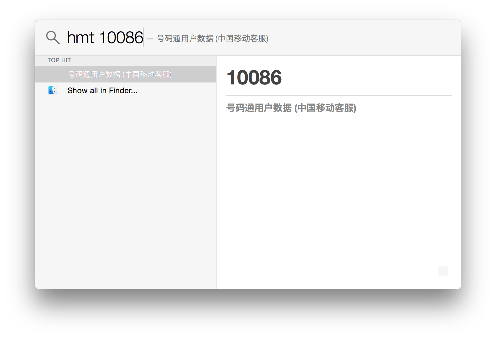
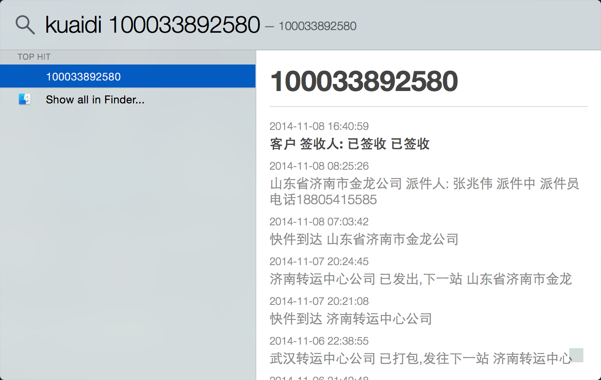
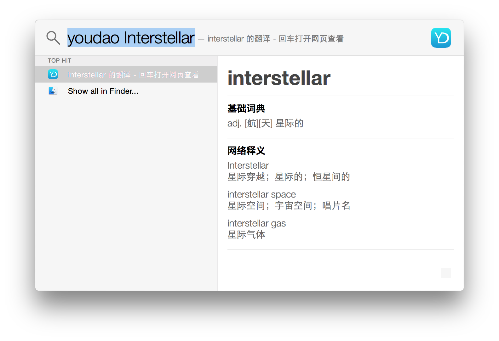
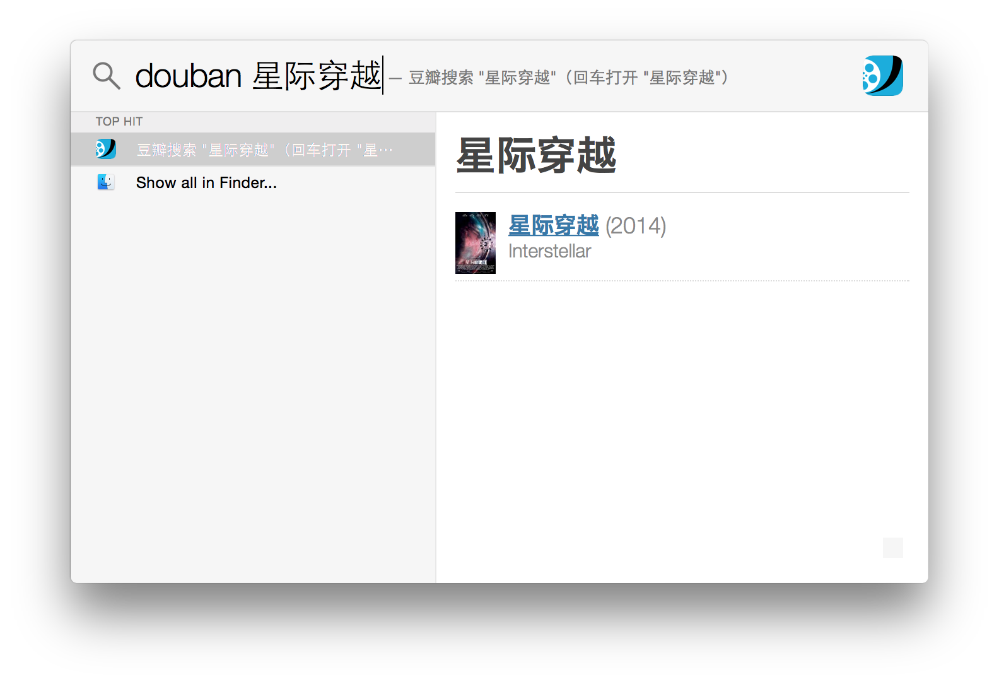

[English](README.md)

FlashlightPlugins
=================

基于 Flashlight (https://github.com/nate-parrott/Flashlight/) 的中文插件列表

## Install ##

- 安装并启用 Flashlight (https://github.com/nate-parrott/Flashlight/releases)
- 复制你需要启用的插件 (bundle 文件) 到 `~/Library/FlashlightPlugins`

如果你熟悉命令行，可以用 `ln -s bundle_name.bundle ~/Library/FlashlightPlugins` 安装插件以便通过 git 更新。

## 使用 ##

### Timestamp ###

- `timestamp` 查看当前时间戳
- `timestamp 1400000000` 将时间戳转化成可读的字符串形式

`ts` 是 `timestamp` 的缩写，你可以用 `ts 1400000000` 以减少输入。

### 搜狗号码通 ###

- `haomatong 10086` 从搜狗号码通查看号码相关信息

`hmt` 是 `haomatong` 的缩写，使用 `hmt 10086` 以减少输入。

### 快递 100 ###

- `kuaidi 100033892580` 从快递 100 获取快递信息

### 有道词典 (作者：[Hyde Wang](https://github.com/callmewhy)) ###

- `youdao one` 英译中
- `youdao 汪` 中译英

`yd` 是 `youdao` 的缩写，你可以使用 `yd flower` 以减少输入。

回车在浏览器中查看有道上的完整释义

### Douban ###

- `douban 星际穿越` 搜索电影

### 知乎日报 (By [小贼ZH](https://github.com/ZHONGHuanGit/ZhihuDaily))

- `zhihu daily`  展示日报
-  `zhihu hot` 展示今日热点话题
-  `zhihu 20141111` 展示某个日期的话题

